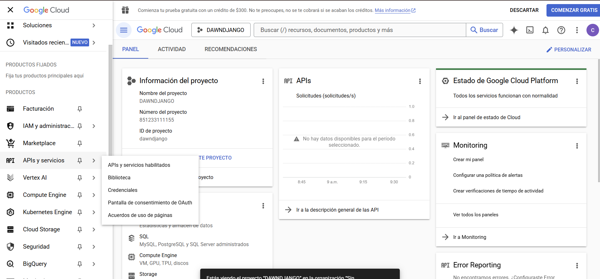
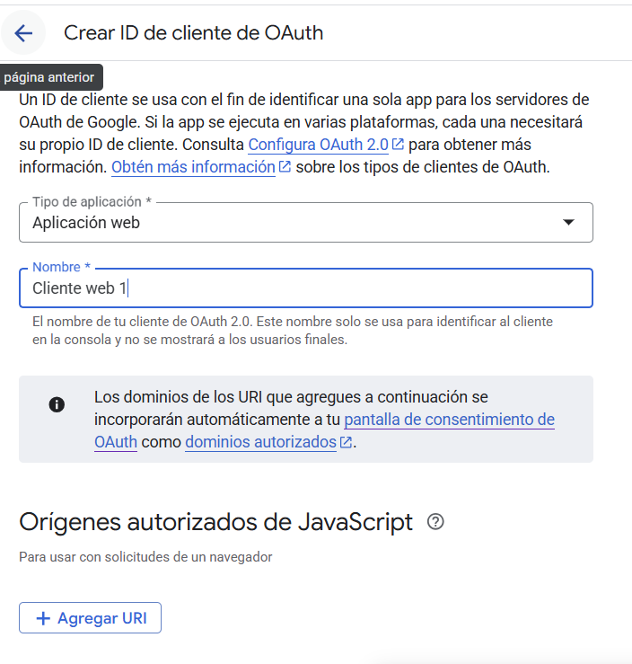

# Google Cloud

1.  Entrar al link https://console.cloud.google.com
2.  Crear un proyecto

    1. Dirigirse a seleccionar proyecto
    2. Crear proyecto, asignandole un nombre (En organización se lo puede dejar vacio.)
    3. API y servicios
    4. Credenciales
       5 .Crear Credenciales > Crear ID de cliente de OAuth 1. Configurar pantalla de consentimiento 2. Llenar información de la app 3. Externo 4. correo electronico 5. Crear
       
    5. Crear IDCliente

    

    En la sección de URIs de redireccionamiento autorizados, añadir

         ```
         http://localhost:8000/oauth/complete/google-oauth2/
         http://127.0.0.1:8000/oauth/complete/google-oauth2/
         ```

    Guardar esta información, incluso de puede descargar el json.

         ```
         GOOGLE_OAUTH2_KEY= ID de cliente
         GOOGLE_OAUTH2_SECRET= Secreto del cliente
         ```

# DJANGO

Crear el archivo login.html en templates/main

```


Login


<div class="row justify-content-center">
    <div class="col-md-6">
        <div class="card">
            <div class="card-header">
                <h3 class="text-center">Login</h3>
            </div>
            <div class="card-body">
                <div class="d-grid gap-2">
                    <a href="" class="btn btn-danger">
                        <i class="fab fa-google"></i> Login with Google
                    </a>
                </div>
            </div>
        </div>
    </div>
</div>

```

En base.html cambiar

```
    <a href="" class="...">Login</a>

```

para poder visualizar la url se debe modificar en :

_views.py_

```
.....

def login(request):
    return render(request, 'main/login.html')

```

_urls.py_

```
urlpatterns = [
    .....
    path('login/', views.login, name='login'),
]
```

Probar

```python
python manage.py migrate
python manage.py runserver
```

Editar la url en la etiqueta a del Login with google

```
  <a href="" class="btn btn-danger">
    <i class="fab fa-google"></i> Login with Google
  </a>
```

Ahora debemos realizar la configuración en backend/settings.py

```
import os
from dotenv import load_dotenv

# Load environment variables
load_dotenv()

......

INSTALLED_APPS = [
....
    'main',
    'social_django',  # Add social-auth-app-django
]

MIDDLEWARE = [
       ...
       'social_django.middleware.SocialAuthExceptionMiddleware',
       ...
]

......
DEFAULT_AUTO_FIELD = 'django.db.models.BigAutoField'

AUTHENTICATION_BACKENDS = (
    'social_core.backends.google.GoogleOAuth2',
    'django.contrib.auth.backends.ModelBackend',
)

# Social Auth settings
SOCIAL_AUTH_GOOGLE_OAUTH2_KEY = os.getenv('GOOGLE_OAUTH2_KEY')
SOCIAL_AUTH_GOOGLE_OAUTH2_SECRET = os.getenv('GOOGLE_OAUTH2_SECRET')


# URLs de redirección después del login
LOGIN_URL = 'login'
LOGIN_REDIRECT_URL = 'index'
LOGOUT_URL = 'index'
LOGOUT_REDIRECT_URL = 'index'
```

Configuración en urls.py

```
      urlpatterns = [
       ...
        path('oauth', include('social_django.urls', namespace='social')),
       ...
   ]
```

instalar

```
pip install social-auth-app-django dotenv
```

El middleware _social_django.middleware.SocialAuthExceptionMiddleware_ se utiliza para manejar las excepciones que pueden ocurrir durante el proceso de autenticación social.

- _Manejo de errores en autenticación social:_ Cuando un usuario intenta iniciar sesión a través de un proveedor social (como Google en tu caso), pueden surgir diversos problemas (por ejemplo, el usuario cancela el proceso, hay un error de red, o el proveedor de OAuth devuelve un error). Este middleware captura estas excepciones que son específicas de la librería social-auth-core.
- _Redirección y mensajes de usuario:_ En lugar de mostrar una página de error genérica o un error del servidor, este middleware permite configurar redirecciones a URLs específicas (por ejemplo, una página de error de login) o mostrar mensajes amigables al usuario cuando ocurre una excepción durante el flujo de autenticación social. Esto mejora la experiencia del usuario al proporcionar retroalimentación más clara y controlada sobre los problemas de autenticación.

```
TEMPLATES = [
    {
      .....
        'OPTIONS': {
            'context_processors': [
              .....
                'social_django.context_processors.backends',  # Add social-auth context processors
                'social_django.context_processors.login_redirect',
            ],
        },
    },
]

```

Los "context processors" en Django son funciones que, antes de que una plantilla sea renderizada, añaden variables al contexto de la plantilla. Esto significa que esas variables estarán disponibles para que las uses en tus archivos HTML (plantillas).

1.  **`'social_django.context_processors.backends'`**:

    - **Propósito:** Este procesador de contexto hace que una lista de todos los backends de autenticación social que tienes configurados en tu `settings.py` (como GoogleOAuth2, Facebook, etc.) esté disponible en el contexto de tus plantillas.
    - **Uso común:** Es extremadamente útil cuando quieres mostrar dinámicamente botones de "Iniciar sesión con [Proveedor]" en tu página de login. En lugar de codificar cada botón manualmente, puedes iterar sobre esta lista en tu plantilla para generar los enlaces a los diferentes proveedores de OAuth que has habilitado.

2.  **`'social_django.context_processors.login_redirect'`**:
    - **Propósito:** Este procesador de contexto se encarga de manejar la lógica de redirección después de un inicio de sesión exitoso.
    - **Uso común:** Cuando un usuario intenta acceder a una página que requiere autenticación, Django lo redirige a la página de inicio de sesión, añadiendo un parámetro `next` a la URL (ej: `/login/?next=/profile/`). Este procesador de contexto se asegura de que este parámetro `next` (que contiene la URL a la que el usuario quería ir originalmente) esté disponible en el contexto de la plantilla de login. Esto permite que, una vez que el usuario inicie sesión exitosamente a través de Google OAuth, `social-auth-app-django` sepa a qué URL debe redirigir al usuario, llevándolo de vuelta a la página que originalmente intentaba visitar.

Modificar el header, para que aparezca los botones según corresponda

```
<!-- Profile menu -->
            <li class="relative">
                
                <button
                    class="align-middle rounded-full focus:shadow-outline-purple focus:outline-none"
                    @click="toggleProfileMenu"
                    @keydown.escape="closeProfileMenu"
                    aria-label="Account"
                    aria-haspopup="true">
                    
                </button>
                <template x-if="isProfileMenuOpen">
                    <ul
                        x-transition:leave="transition ease-in duration-150"
                        x-transition:leave-start="opacity-100"
                        x-transition:leave-end="opacity-0"
                        @click.away="closeProfileMenu"
                        @keydown.escape="closeProfileMenu"
                        class="absolute right-0 w-56 p-2 mt-2 space-y-2 text-gray-600 bg-white border border-gray-100 rounded-md shadow-md dark:border-gray-700 dark:text-gray-300 dark:bg-gray-700"
                        aria-label="submenu">
                        <li class="flex">
                            <a
                                class="inline-flex items-center w-full px-2 py-1 text-sm font-semibold transition-colors duration-150 rounded-md hover:bg-gray-100 hover:text-gray-800 dark:hover:bg-gray-800 dark:hover:text-gray-200"
                                href="">
                                <svg
                                    class="w-4 h-4 mr-3"
                                    aria-hidden="true"
                                    fill="none"
                                    stroke-linecap="round"
                                    stroke-linejoin="round"
                                    stroke-width="2"
                                    viewBox="0 0 24 24"
                                    stroke="currentColor">
                                    <path
                                        d="M16 7a4 4 0 11-8 0 4 4 0 018 0zM12 14a7 7 0 00-7 7h14a7 7 0 00-7-7z"></path>
                                </svg>
                                <span>Profile</span>
                            </a>
                        </li>
                        <li class="flex">
                            <a
                                class="inline-flex items-center w-full px-2 py-1 text-sm font-semibold transition-colors duration-150 rounded-md hover:bg-gray-100 hover:text-gray-800 dark:hover:bg-gray-800 dark:hover:text-gray-200"
                                href="#">
                                <svg
                                    class="w-4 h-4 mr-3"
                                    aria-hidden="true"
                                    fill="none"
                                    stroke-linecap="round"
                                    stroke-linejoin="round"
                                    stroke-width="2"
                                    viewBox="0 0 24 24"
                                    stroke="currentColor">
                                    <path
                                        d="M10.325 4.317c.426-1.756 2.924-1.756 3.35 0a1.724 1.724 0 002.573 1.066c1.543-.94 3.31.826 2.37 2.37a1.724 1.724 0 001.065 2.572c1.756.426 1.756 2.924 0 3.35a1.724 1.724 0 00-1.066 2.573c.94 1.543-.826 3.31-2.37 2.37a1.724 1.724 0 00-2.572 1.065c-.426 1.756-2.924 1.756-3.35 0a1.724 1.724 0 00-2.573-1.066c-1.543.94-3.31-.826-2.37-2.37a1.724 1.724 0 00-1.065-2.572c-1.756-.426-1.756-2.924 0-3.35a1.724 1.724 0 001.066-2.573c-.94-1.543.826-3.31 2.37-2.37.996.608 2.296.07 2.572-1.065z"></path>
                                    <path
                                        d="M15 12a3 3 0 11-6 0 3 3 0 016 0z"></path>
                                </svg>
                                <span>Settings</span>
                            </a>
                        </li>
                        <li class="flex">
                            <a href=""
                               class="inline-flex items-center w-full px-2 py-1 text-sm font-semibold transition-colors duration-150 rounded-md hover:bg-gray-100 hover:text-gray-800 dark:hover:bg-gray-800 dark:hover:text-gray-200">
                                <svg
                                    class="w-4 h-4 mr-3"
                                    aria-hidden="true"
                                    fill="none"
                                    stroke-linecap="round"
                                    stroke-linejoin="round"
                                    stroke-width="2"
                                    viewBox="0 0 24 24"
                                    stroke="currentColor">
                                    <path
                                        d="M11 16l-4-4m0 0l4-4m-4 4h14m-5 4v1a3 3 0 01-3 3H6a3 3 0 01-3-3V7a3 3 0 013-3h7a3 3 0 013 3v1"></path>
                                </svg>
                                <span>Log out</span>
                            </a>
                        </li>
                    </ul>
                </template>
                
                <a href=""
                   class="inline-flex items-center px-4 py-2 text-sm font-medium text-white bg-purple-600 hover:bg-purple-700 rounded-lg focus:outline-none focus:ring-2 focus:ring-offset-2 focus:ring-purple-500 transition-colors duration-200">
                    Login
                </a>
                
            </li>
```

Podemos mejorarlo
Agregar

```
<a href=""
<a href="">
```

Agregar el archivo profile.html

```



Perfil de Usuario



<div class="flex items-center justify-center min-h-screen bg-gray-50 dark:bg-gray-900 w-full">
    <div class="w-full max-w-4xl p-8 space-y-8 bg-white dark:bg-gray-800 rounded-lg shadow-md">
        <div class="text-center">
            <h2 class="mt-6 text-3xl font-bold text-gray-900 dark:text-gray-100">
                Perfil de Usuario
            </h2>
        </div>

        <div class="mt-8 space-y-6">
            <!-- Información del Usuario -->
            <div class="bg-gray-50 dark:bg-gray-700 p-6 rounded-lg">
                <div class="grid grid-cols-1 md:grid-cols-2 gap-6">
                    <div class="space-y-4">
                        <div>
                            <h3 class="text-lg font-semibold text-gray-700 dark:text-gray-200">Información Personal</h3>
                            <p class="mt-2 text-gray-600 dark:text-gray-300">
                                <span class="font-medium">Nombre:</span> {{ user.get_full_name|default:user.username }}
                            </p>
                            <p class="mt-2 text-gray-600 dark:text-gray-300">
                                <span class="font-medium">Email:</span> {{ user.email }}
                            </p>
                            <p class="mt-2 text-gray-600 dark:text-gray-300">
                                <span class="font-medium">Último acceso:</span> {{ user.last_login|date:"d/m/Y H:i" }}
                            </p>
                        </div>
                    </div>

                    <div class="space-y-4">
                        <div>
                            <h3 class="text-lg font-semibold text-gray-700 dark:text-gray-200">Información de la Cuenta</h3>
                            <p class="mt-2 text-gray-600 dark:text-gray-300">
                                <span class="font-medium">Usuario desde:</span> {{ user.date_joined|date:"d/m/Y" }}
                            </p>
                            
                            <p class="mt-2 text-gray-600 dark:text-gray-300">
                                <span class="font-medium">Proveedor:</span> {{ social_auth.provider|title }}
                            </p>
                            
                        </div>
                    </div>
                </div>
            </div>

            <!-- Botones de Acción -->
            <div class="flex justify-center space-x-4">
                <a href=""
                   class="px-6 py-2 text-sm font-medium text-white bg-purple-600 hover:bg-purple-700 rounded-lg focus:outline-none focus:ring-2 focus:ring-offset-2 focus:ring-purple-500 transition-colors duration-200">
                    Volver al Dashboard
                </a>
                <a href=""
                   class="px-6 py-2 text-sm font-medium text-white bg-red-600 hover:bg-red-700 rounded-lg focus:outline-none focus:ring-2 focus:ring-offset-2 focus:ring-red-500 transition-colors duration-200">
                    Cerrar Sesión
                </a>
            </div>
        </div>
    </div>
</div>

```

Modificar las urls y views

```
from django.shortcuts import render
from django.contrib.auth.decorators import login_required
from django.contrib.auth import logout
from django.shortcuts import redirect
from social_django.models import UserSocialAuth


def index(request):
    user = request.user
    social_auth = None
    if user.is_authenticated:
        social_auth = user.social_auth.first()
    context = {
        'user': user,
        'social_auth': social_auth
    }
    return render(request, 'main/index.html', context)

def login(request):
    return render(request, 'main/login.html')

@login_required
def profile(request):
    user = request.user
    social_auth = user.social_auth.first()
    context = {
        'user': user,
        'social_auth': social_auth
    }
    return render(request, 'main/profile.html', context)

def logout_view(request):
    # Eliminar la sesión social si existe
    if request.user.is_authenticated:
        UserSocialAuth.objects.filter(user=request.user).delete()
    # Cerrar la sesión de Django
    logout(request)
    # Redirigir al login
    return redirect('index')
```

El `@login_required` es un **decorador** de Django. En Python, un decorador es una función que toma otra función como argumento y extiende o modifica su comportamiento sin alterar su estructura fundamental.

Al aplicar `@login_required` a la función `profile`, estás garantizando que:

1.  **Solo usuarios logueados pueden ver su perfil:** Si alguien que no ha iniciado sesión intenta ir a la URL asociada con la vista `profile`, será enviado a la página de `login`.
2.  **Seguridad:** Protege la información del perfil del usuario, ya que solo el usuario autenticado puede acceder a su propia página de perfil.

Es una forma sencilla y eficaz de añadir una capa de seguridad a tus vistas de Django.

Modificar

```
from django.urls import path,include
from . import views

urlpatterns = [
    path('', views.index, name='index'),
    path('login/', views.login, name='login'),
    path('profile/', views.profile, name='profile'),
    path('logout/', views.logout_view, name='logout'),
    path('oauth/', include('social_django.urls', namespace='social')),
]
```

## Autorización

Buscamos que apartir de la base de datos donde existen los usuarios tales como administradores y otros roles darle permiso

para el cual como vas a cambiar el pipeline normal de autenticación de django para asignarle ciertas permisos y poder ver si el usuario ya pertenece a uno

templates/main/pipeline.py

```python
from django.contrib.auth import get_user_model
from django.contrib.auth.models import Group

User = get_user_model()


def connect_by_email(backend, uid, user=None, *args, **kwargs):
    if user:
        return None

    email = kwargs.get("details", {}).get("email")
    first_name = kwargs.get("details", {}).get("first_name", "")
    last_name = kwargs.get("details", {}).get("last_name", "")
    username = kwargs.get("username") or email.split("@")[0]

    if not email:
        return None

    try:
        user = User.objects.get(email=email)
        return {"user": user}

    except User.DoesNotExist:
        print("Usuario no existe, creando usuario")
        user = User.objects.create_user(
            username=username,
            email=email,
            first_name=first_name,
            last_name=last_name,
            is_active=True,
        )

        group, _ = Group.objects.get_or_create(name="Google Users")
        user.groups.add(group)
        user.save()

        return {"user": user}
```

luego añadir ese metodo al pipeline

en settings.py

```python

....
## Agregar para autorizacion

SOCIAL_AUTH_PIPELINE = (
"social_core.pipeline.social_auth.social_details",
"social_core.pipeline.social_auth.social_uid",
"social_core.pipeline.social_auth.auth_allowed",
"social_core.pipeline.social_auth.social_user",
"main.pipeline.connect_by_email", ## Agregar
"social_core.pipeline.user.get_username",
"social_core.pipeline.user.create_user",
"social_core.pipeline.social_auth.associate_user",
"social_core.pipeline.social_auth.load_extra_data",
"social_core.pipeline.user.user_details",
)

```

### Explicación paso a paso

```python
from django.contrib.auth import get_user_model
from django.contrib.auth.models import Group

User = get_user_model()
```

- **Importa el modelo de usuario** (puede ser el modelo por defecto de Django o uno personalizado).
- **Importa el modelo de grupo** para asignar roles o permisos.

---

#### Función principal: `connect_by_email`

```python
def connect_by_email(backend, uid, user=None, *args, **kwargs):
    if user:
        return None
```

- Si ya hay un usuario autenticado, no hace nada y termina.

---

```python
    email = kwargs.get("details", {}).get("email")
    first_name = kwargs.get("details", {}).get("first_name", "")
    last_name = kwargs.get("details", {}).get("last_name", "")
    username = kwargs.get("username") or email.split("@")[0]
```

- **Extrae información** del usuario que viene del proveedor social (Google, etc.): email, nombre, apellido y username.

---

```python
    if not email:
        return None
```

- Si no hay email, no puede continuar (el email es obligatorio para identificar al usuario).

---

```python
    try:
        user = User.objects.get(email=email)
        return {"user": user}
```

- **Busca si ya existe un usuario con ese email** en la base de datos.
- Si existe, lo retorna para que el pipeline lo use y lo conecte.

---

```python
    except User.DoesNotExist:
        print("Usuario no existe, creando usuario")
        user = User.objects.create_user(
            username=username,
            email=email,
            first_name=first_name,
            last_name=last_name,
            is_active=True,
        )
```

- Si el usuario **no existe**, lo crea con los datos recibidos.

---

```python
        group, _ = Group.objects.get_or_create(name="Google Users")
        user.groups.add(group)
        user.save()
```

- **Asigna el usuario a un grupo** llamado "Google Users". Si el grupo no existe, lo crea.
- Esto es útil para dar permisos o roles especiales a los usuarios que se registran por Google.

---

```python
        return {"user": user}
```

- Devuelve el usuario recién creado para que el pipeline de autenticación lo use.

---

## Creación de modelos

Reemplazaar contenido por (models.py)

```python
from django.db import models
# Create your models here.

class Permisos(models.Model):  # puede ser cualquier modelo real o ficticio
    class Meta:
        permissions = [
            ("acceso_admin_panel", "Puede acceder al panel de administración"),
            ("acceso_solo_Usuarios", "Puede acceder a informacion de solo Usurios"),
        ]
```

## Vistas por permisos

```python
# añadir permission_required
from django.contrib.auth.decorators import login_required, permission_required
.....

.....
@login_required
@permission_required("main.acceso_admin_panel", raise_exception=True)
def admin_panel(request):
    return render(request, "main/admin_panel.html")


def error_403_view(request, exception=None):
    return render(request, "main/403.html", status=403)
```

Para esto crear el archivo admin_panel.html

```html
<!-- Extend "main/base.html" -->


<!-- START - Block title -->
 Backend - Inicio 
<!-- END - Block title -->

<!-- START - Block content -->

<div class="flex flex-col flex-1 w-full">
  <div class="text-6xl font-bold text-white text-center">
    <strong>ADMINISTRADOR</strong>
  </div>
  <div class="flex flex-col flex-1 w-full">
     
  </div>
</div>


<!-- END - Block content -->
```

y 403.html

```html

<!DOCTYPE html>
<html>
  <head>
    <title>Acceso denegado</title>
    <!-- Local stylesheets -->
    <link rel="stylesheet" href="" />
  </head>
  <body class="w-full">
    <main
      class="flex flex-col items-center justify-center h-screen w-full text-center space-y-2"
    >
      <h1 class="text-center font-bold text-6xl">403 - Acceso Denegado</h1>
      <p class="text-2xl">No tienes permiso para acceder a esta sección.</p>
      
      <a href="/" class="text-2xl">Volver al inicio</a>
    </main>
  </body>
</html>
```

Para que funcione se debe agregar en backend/urls.py

```python
from django.contrib import admin
from django.urls import path,include
# Añadir estas importaciones
from django.conf import settings
from django.conf.urls.static import static
urlpatterns = [
    path('admin/', admin.site.urls),
    path('', include('main.urls')),
]

handler403 = "main.views.error_403_view"

if settings.DEBUG:
    urlpatterns += static(
        settings.STATIC_URL, document_root=settings.STATICFILES_DIRS[0]
    )
```

y en main/urls.py debe verse así

```python
from django.urls import path, include
from . import views

urlpatterns = [
    path("", views.index, name="index"),
    path("login/", views.login, name="login"),
    path("profile/", views.profile, name="profile"),
    path("logout/", views.logout_view, name="logout"),
    path("oauth/", include("social_django.urls", namespace="social")),
    path("admin_panel/", views.admin_panel, name="admin_panel"), # añadir
]
```

### Crear permisos

Crear signals.py

```python
from django.db.models.signals import post_migrate
from django.contrib.auth.models import Permission, Group
from django.contrib.contenttypes.models import ContentType
from django.dispatch import receiver
from django.apps import apps


@receiver(post_migrate)
def crear_permiso_admin(sender, **kwargs):
    PermisosModel = apps.get_model("main", "Permisos")  # o el modelo real que usaste
    content_type = ContentType.objects.get_for_model(PermisosModel)

    perm, created = Permission.objects.get_or_create(
        codename="acceso_admin_panel",
        name="Puede acceder al panel de administración",
        content_type=content_type,
    )
    grupo, _ = Group.objects.get_or_create(name="Administrador")
    grupo.permissions.add(perm)
```

### Simular permisos en profile.html

Actualizar el html

```html
<!-- Botones de Acción -->
<div class="flex justify-center space-x-4">
  <a
    href=""
    class="px-6 py-2 text-sm font-medium text-white bg-blue-600 hover:bg-blue-700 rounded-lg focus:outline-none focus:ring-2 focus:ring-offset-2 focus:ring-blue-500 transition-colors duration-200"
  >
    Panel de Administrador
  </a>
  <a
    href=""
    class="px-6 py-2 text-sm font-medium text-white bg-purple-600 hover:bg-purple-700 rounded-lg focus:outline-none focus:ring-2 focus:ring-offset-2 focus:ring-purple-500 transition-colors duration-200"
  >
    Volver al Dashboard
  </a>
  <a
    href=""
    class="px-6 py-2 text-sm font-medium text-white bg-red-600 hover:bg-red-700 rounded-lg focus:outline-none focus:ring-2 focus:ring-offset-2 focus:ring-red-500 transition-colors duration-200"
  >
    Cerrar Sesión
  </a>
</div>
```
